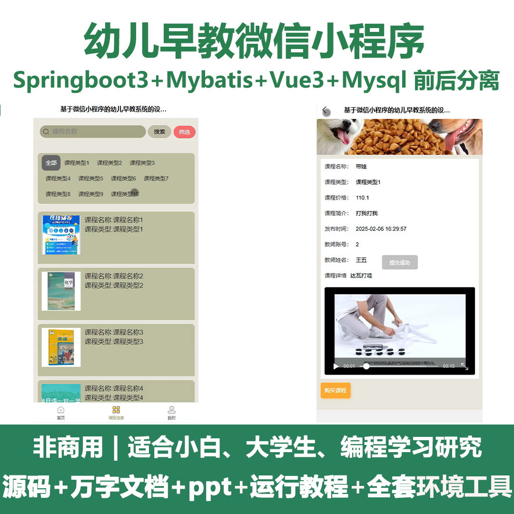
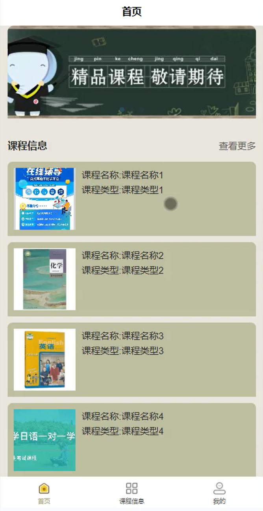
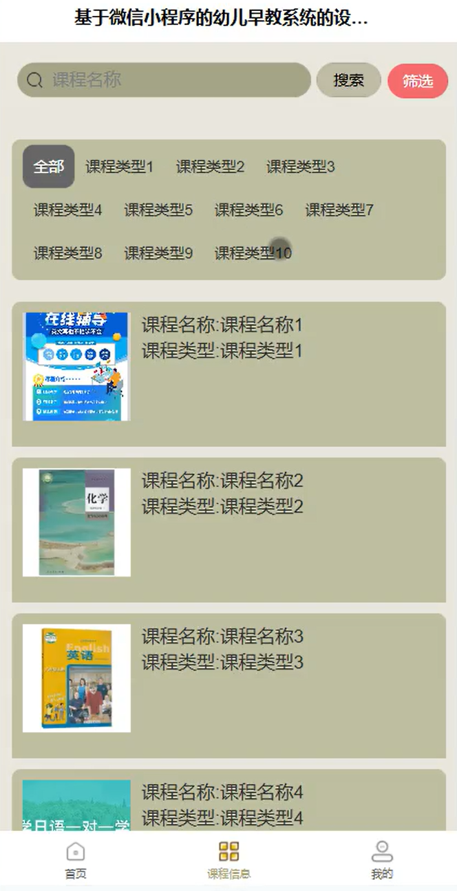
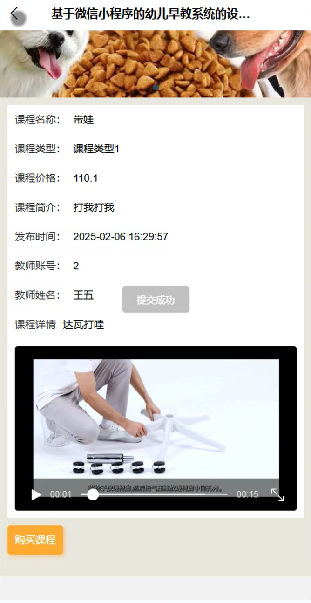
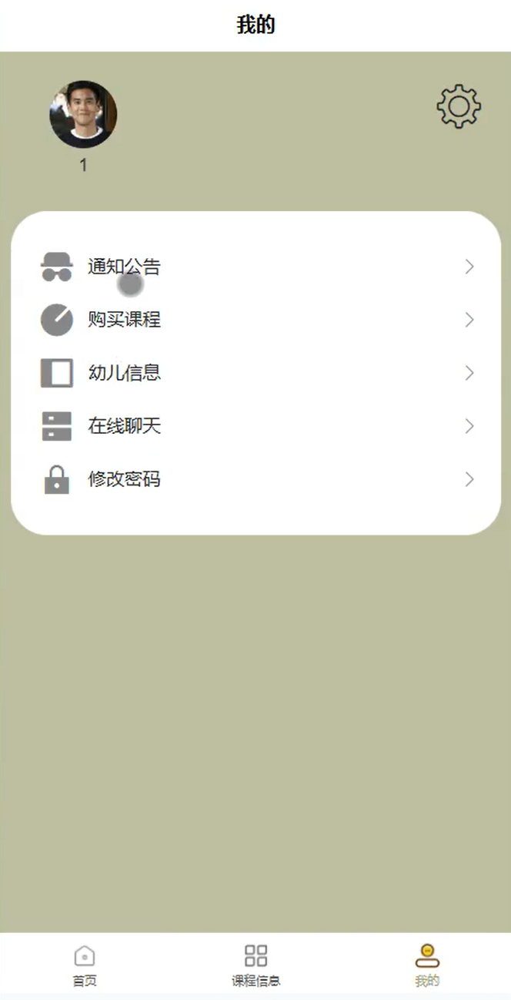
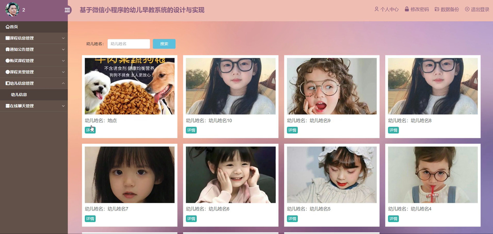
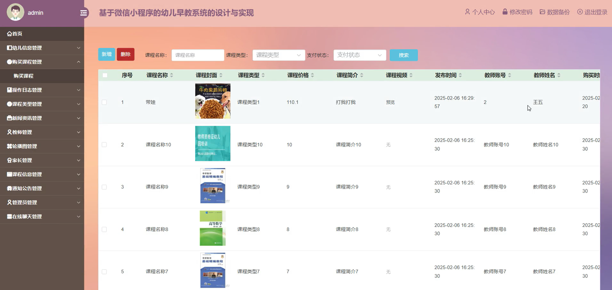
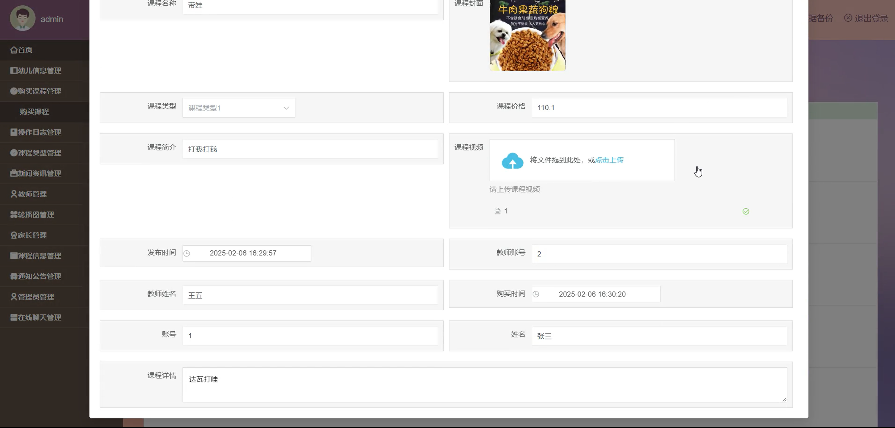
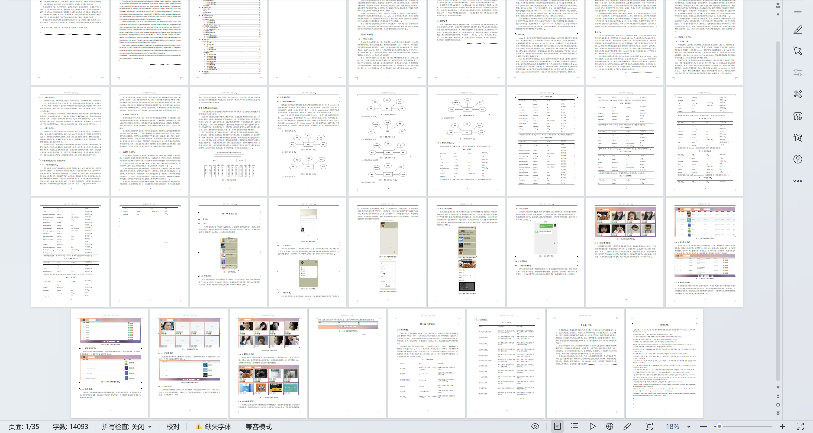

# mpweixinA206D
mpweixinA206D幼儿早教微信小程序+LW+PPT
 
## 源码问题查看主页咨询

### 一、关键词
幼儿信息管理，课程信息管理，家长管理

### 二、作品包含
源码+数据库+万字设计文档+PPT+全套环境和工具资源+本地部署教程

### 三、项目技术
前端技术： Html、Css、Js、Vue3.0、Element-plus、uniapp
后端技术：Java、SpringBoot3.0、MyBatis

### 四、运行环境（以下版本亲测，其他版本兼容性请自行测试）
开发工具：IDEA/eclipse  + VSCODE + 微信开发者工具 + HBuilder X

数据库：MySQL5.7（最低要5.7版本）

数据库管理工具：Navicat10以上版本

环境配置软件： JDK17 + Maven3.6.3

前端Nodejs：20

浏览器：谷歌浏览器

### 五、项目介绍
项目编号：mpweixinA206D

幼儿早教微信小程序在线沟通等功能，助力早教服务高效开展与亲子早教需求便捷满足。

角色：管理员、用户、教师

管理员功能：首页、幼儿信息管理、购买课程管理、操作日志管理、课程类型管理、新闻资讯管理、教师管理、家长管理、课程信息管理、通知公告管理、管理员管理、在线聊天管理。

用户功能：首页、课程信息、我的通知公告、购买课程、幼儿信息、在线聊天、修改密码。

教师功能：首页、课程信息管理、通知公告管理、购买课程管理、课程类型管理、幼儿信息管理、在线聊天管理。

### 六、运行截图

